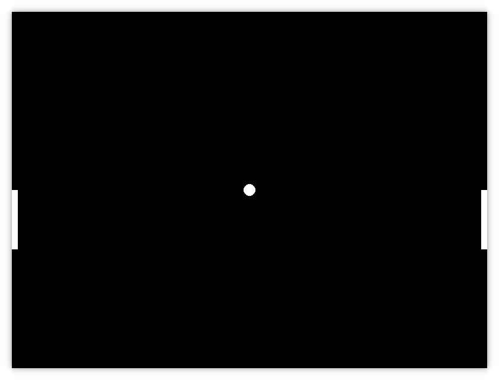
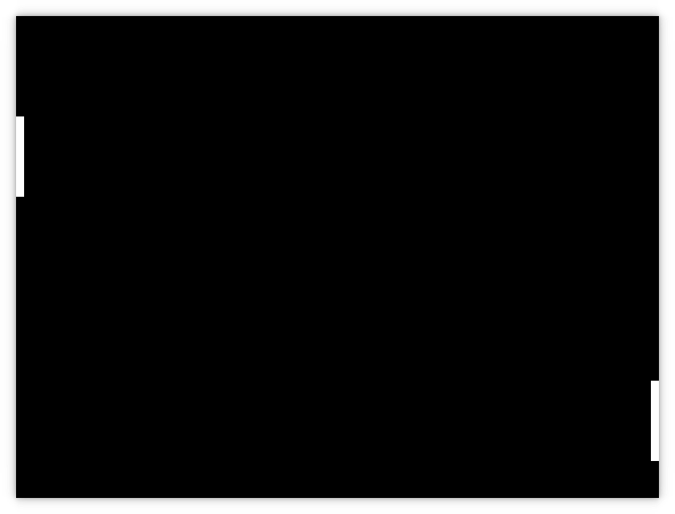
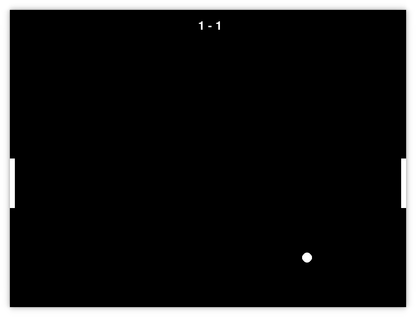

# Pong

## Guida per i ragazzi

Ciao a tutti, e benvenuti alla guida per l'attività Pong!

In questa attività, impareremo a creare un gioco di Pong utilizzando il modulo `pygame` di Python. 

Il Pong è un gioco molto semplice che coinvolge due giocatori che si sfidano a colpi di palla.

Il nostro obiettivo è creare un gioco che includa i seguenti elementi:
- Due paddle controllati dai giocatori
- Una pallina che rimbalza tra i paddle
- ...un sistema di punteggio per tenere traccia dei punti

Prima di iniziare, assicurati di avere installato Python e il modulo `pygame` sul tuo computer.

Se non hai già installato Python e `pygame`, puoi farlo eseguendo il seguente comando su un terminale (chiedi aiuto ad un mentor se necessario):

```
pip install pygame
```

Una volta installato `pygame`, sei pronto per iniziare a creare il tuo gioco di Pong!

Buon divertimento e buona programmazione!

## Fase 0
### Il piano cartesiano in Pygame
Il piano cartesiano è un sistema di coordinate che ci permette di posizionare oggetti nello spazio. In altre parole, è un modo per rappresentare la posizione di un oggetto in un gioco.

È formato da due assi: l'asse x e l'asse y. L'asse x rappresenta la larghezza dello schermo, mentre l'asse y rappresenta l'altezza dello schermo.

In Pygame, l'origine del piano, cioè da dove "nasce", si trova nell'angolo in alto a sinistra dello schermo, con l'asse y che cresce verso il basso.

Quindi, se vogliamo posizionare un oggetto al centro dello schermo, dovremo calcolare le coordinate x e y in base alla larghezza e all'altezza dello schermo.

Per muovere un oggetto **in alto** bisogna **diminuire il valore dell'asse y**, mentre per muoverlo **in basso** bisogna **aumentare il valore dell'asse y**.

Per disegnare un oggetto invece **al centro** dello schermo, bisogna **dividere la larghezza e l'altezza dello schermo per 2**.

## Fase 1: paddle e pallina
[](img/1.png)

Eccoci, pronti per iniziare! 

Innanzitutto dobbiamo disegnare la nostra **pallina** e i nostri **paddle** sullo schermo.

Vedrete dei **pallini**: lì è dove andremo a **mettere il codice** per far funzionare il gioco.

Sotto la riga `# Posizione e velocità della pallina` scriviamo:
```python
x_pallina, y_pallina = L_SCHERMO // 2, A_SCHERMO // 2
dx_pallina, dy_pallina = 5, 5
grandezza_pallina = 10

paddle1_y, paddle2_y = A_SCHERMO // 2, A_SCHERMO // 2
paddle_larghezza, paddle_altezza = 10, 100
velocita_paddle = 7
```

Stiamo dicendo al computer di costruire una **pallina al centro dello schermo**.

Per i **paddle**, stiamo dicendo al computer di costruirli **ai lati dello schermo**.

Adesso è arrivato il momento di disegnarli!

Andando verso la fine, sotto la riga `schermo.fill(0, 0, 0)`, scriviamo:
```python
pygame.draw.circle(schermo, BIANCO, (x_pallina, y_pallina), grandezza_pallina)

pygame.draw.rect(schermo, BIANCO, (0, paddle1_y, paddle_larghezza, paddle_altezza))

pygame.draw.rect(schermo, BIANCO, (L_SCHERMO - paddle_larghezza, paddle2_y, paddle_larghezza, paddle_altezza))
```

Se tutto è andato per il verso giusto, premiamo **F5** per eseguire il codice e vedere la nostra pallina e i paddle!


### Muoviamo i paddle
[](img/12.png)

È il momento di far **muovere i paddle**, che sono i nostri giocatori!

Nel codice c'è un `while True`. Questo ciclo viene eseguito continuamente, e ci permette di aggiornare il gioco ogni secondo.

Sotto la riga `# Controlli paddle` scriviamo:
```python
keys = pygame.key.get_pressed()
if keys[pygame.K_w] and paddle1_y > 0:
    paddle1_y -= velocita_paddle
if keys[pygame.K_s] and paddle1_y < A_SCHERMO - paddle_altezza:
    paddle1_y += velocita_paddle
```

Se premiamo **F5** e proviamo a premere i tasti **W** e **S**, vedremo il nostro **paddle 1** muoversi su e giù!

Continuiamo scrivendo il codice per il giocatore 2:
```python
    if keys[pygame.K_UP] and paddle2_y > 0:
        paddle2_y -= velocita_paddle
    if keys[pygame.K_DOWN] and paddle2_y < A_SCHERMO - paddle_altezza:
        paddle2_y += velocita_paddle
```

Indovinate un po'? Se premiamo **F5** e proviamo a premere i tasti **freccia su** e **freccia giù**, vedremo anche il nostro **paddle 2** muoversi su e giù!


### Muoviamo la pallina
Sotto la riga `# Movimento pallina` scriviamo:
```python
x_pallina += dx_pallina
y_pallina += dy_pallina
```

Stiamo dicendo alla pallina di **muoversi** in base alla **sua velocità**.

Se premiamo **F5**, vedremo la nostra pallina muoversi verso destra e verso il basso!


## Fase 2: collisioni e rimbalzi
Ora che i paddle e la pallina si muovono, dobbiamo farli **collidere** e **rimbalzare**!

**Collidere** vuol dire che il gioco deve capire **quando** la pallina colpisce un paddle.

**Rimbalzare** vuol dire che la pallina deve **cambiare direzione** quando colpisce un paddle.

Capiamo innanzitutto come gestire i bordi dello schermo: vorremmo che la pallina rimbalzi quando colpisce i bordi.

Sotto la riga `# Collisione con il bordo superiore e inferiore` scriviamo:
```python
if y_pallina <= grandezza_pallina or y_pallina >= A_SCHERMO - grandezza_pallina:
        dy_pallina *= -1
```

Premendo **F5**, noteremo che la pallina rimbalza quando colpisce il **bordo superiore** o il **bordo inferiore**!

Adesso proviamo a muovere il paddle di destra e a farlo **collidere** con la pallina.

Non ci riusciremo. Perché? Cosa manca?

Manca il codice per **collidere** e **rimbalzare** la pallina sui paddle!

Sotto la riga `# Collisione con il paddle sinistro` scriviamo:
```python
if (x_pallina - grandezza_pallina <= paddle_larghezza and
    paddle1_y < y_pallina < paddle1_y + paddle_altezza):
    dx_pallina *= -1
    x_pallina = paddle_larghezza + grandezza_pallina 
```

Sotto la riga `# Collisione con il paddle destro` scriviamo:
```python
if (x_pallina + grandezza_pallina >= L_SCHERMO - paddle_larghezza and
    paddle2_y < y_pallina < paddle2_y + paddle_altezza):
    dx_pallina *= -1
    x_pallina = L_SCHERMO - paddle_larghezza - grandezza_pallina 
```

Facciamo cambiare direzione alla pallina quando colpisce un paddle, facendola rimbalzare!

Premiamo F5 e colpiamo la pallina sui paddle: INCREDIBILE, ci siamo quasi riusciti!

L'unica cosa che dobbiamo gestire è **quando la pallina esce dai lati dello schermo**.

In questo caso, dobbiamo **riposizionare la pallina al centro**.

Sotto la riga `# Reset della pallina se va oltre i bordi` scriviamo:
```python
if x_pallina < 0 or x_pallina > L_SCHERMO:
    x_pallina, y_pallina = L_SCHERMO // 2, A_SCHERMO // 2
    dx_pallina = -dx_pallina
```

Se premiamo **F5**, vedremo la nostra pallina rimbalzare tra i paddle e, nel caso esca, **riposizionarsi al centro**!

Ecco fatto! Abbiamo completato la nostra versione base di Pong! ^^

## Fase 3: punteggio
[](img/3.png)

Siamo quasi arrivati alla fine di questo Dojo, ma c'è ancora una cosa che manca: il **punteggio**!

Per farlo, dobbiamo **controllare** quando la pallina esce dai lati dello schermo, da che lato è uscita, e **aggiornare il punteggio**.

Sotto `velocita_paddle" scriviamo:
```python
punti_giocatore_1 = 0
punti_giocatore_2 = 0
```

che saranno i nostri **punti iniziali**.

Dobbiamo riscrivere la funzione di reset della pallina: infatti dobbiamo **aggiornare il punteggio** quando la pallina esce dai lati dello schermo.

Sotto la riga `# Reset della pallina se va oltre i bordi` aggiungiamo:
```python
if x_pallina < 0 or x_pallina > L_SCHERMO:    
    x_pallina, y_pallina = L_SCHERMO // 2, A_SCHERMO // 2
    dx_pallina = -dx_pallina

    # Punto per il giocatore di destra
    if x_pallina < 0:
        punti_giocatore_2 += 1
        
    # Punto per il giocatore di sinistra
    if x_pallina > L_SCHERMO:
        punti_giocatore_1 += 1


```

Adesso manca solo una cosa: **disegnare il punteggio**!

Alla fine del file, sopra la riga `pygame.display.update()` scriviamo:
```python
    font = pygame.font.Font(None, 36)
    testo_punti = font.render(f"{punti_giocatore_1} - {punti_giocatore_2}", True, BIANCO)
    schermo.blit(testo_punti, (L_SCHERMO // 2 - 20, 20))
```

Se premiamo **F5**, vedremo il nostro punteggio in alto a centro schermo che si aggiorna ogni volta che la pallina esce dai lati!

Se sei arrivato fin qui, **COMPLIMENTI!** 

Hai completato il tuo primo gioco di Pong in Python!